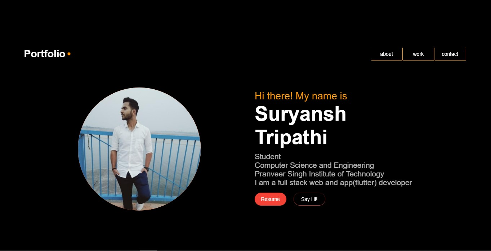

# [Portfolio-flutter-webapp](https://portfolio-flutter-webapp.netlify.app/#/) <br>
 A beautiful Portfolio webapp build with <b>Flutter<b> 

<p align="center">
</br></p>


## How to Use 

**Step 1:**

Download or clone this repo by using the link below:

```https://github.com/Suryansh1004/Portfolio-flutter-webapp.git```

**Step 2:**

Run the following commands in the terminal to use the latest version of the Flutter SDK from the beta channel and enable web support:

```
$flutter channel beta
$flutter upgrade
$flutter config --enable-web
```

**Step 3:**

In the folder `Portfolio-master` , it contains main codebase for the project. 
Go to the `Portfolio-master` folder and run the following command.

``` 
flutter run -d chrome
```
You will be able to run the project Successfully with the help of these steps.<br>

If you want to deploy the webapp then use the following command:

``` 
flutter build web
```
Now you can host your webapp code present in `Portfolio-master/build/web/` folder. 

### Technologies Used

## [Flutter](https://flutter.dev/docs/get-started/web) </br>
 Flutter is Google’s UI toolkit for building beautiful, natively compiled applications for mobile, web, and desktop from a single codebase.

### Installation
 -   For [Windows](https://flutter.dev/docs/get-started/install/windows)
 -   For [MacOS](https://flutter.dev/docs/get-started/install/macos)
 -   For [Linux](https://flutter.dev/docs/get-started/install/linux)
 </br>


## ScreenShots
 <p align="center">

</p>
 
  <br>
If you liked this project, don’t forget to ⭐ star the repo.


